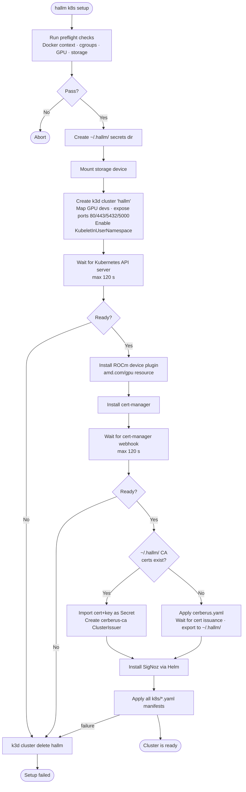

# hallm

LLM-powered assistant exposing an MCP server and a CLI interface, backed by Postgres.

## Stack

| Layer | Tool |
| --- | --- |
| Language | Python 3.14 |
| Package manager | [uv](https://docs.astral.sh/uv/) |
| MCP server | [FastMCP](https://github.com/jlowin/fastmcp) |
| CLI | [Typer](https://typer.tiangolo.com/) |
| Type checker | [ty](https://github.com/astral-sh/ty) |
| Linter / formatter | [Ruff](https://docs.astral.sh/ruff/) |
| Database | Postgres 17 |
| Tests | Pytest + pytest-cov (98 % floor) |
| Containers | Docker Compose |
| Local Kubernetes | k3d (managed via `hallm k8s`) |
| TLS | cert-manager + self-signed CA |

## Getting started

### Prerequisites

- [uv](https://docs.astral.sh/uv/getting-started/installation/) ≥ 0.5
- Docker + Docker Compose
- [k3d](https://k3d.io/) (for the local Kubernetes cluster)

### Local setup

```bash
# Clone and enter the repo
git clone <repo-url> && cd hallm

# Copy env vars and edit as needed
cp .env.example .env

# Create venv and install deps (including dev)
uv sync

# Install pre-commit hooks
uv run pre-commit install

# Start Postgres
docker compose up db -d

# Run migrations
uv run tortoise migrate

# Run the MCP server
uv run hallm mcp serve
```

### Testing

```bash
uv run pytest
```

`pytest-cov` is wired in via `pyproject.toml` and will fail if total branch
coverage drops below **98 %**. The XML report is written to `coverage.xml`.

### Running the full stack with Docker

```bash
docker compose up --build
```

## CLI overview

`hallm` is a Typer app. Calling any namespace without a subcommand prints help.

```bash
uv run hallm                 # root help
uv run hallm k8s             # cluster lifecycle + ops help
uv run hallm db bootstrap    # create per-service databases
uv run hallm mcp serve       # start the MCP server
uv run hallm container publish <name>   # build + push a Docker image
```

| Namespace | Commands |
| --- | --- |
| `hallm k8s` | `preflight`, `setup`, `healthcheck`, `nuke`, `get-cert`, `sync-secrets`, `remove`, `seed-heimdall` |
| `hallm db` | `bootstrap` |
| `hallm mcp` | `serve` |
| `hallm container` | `publish` |

## Local Kubernetes cluster

The `hallm k8s` namespace manages a local k3d cluster that mirrors the
production environment. Manifests live in [`k8s/`](k8s/); the CLI provisions
and tears the cluster down on a dedicated rootless Docker daemon.

```bash
# create cluster, install GPU device plugin + cert-manager, bootstrap Cerberus CA
uv run hallm k8s setup
# verify cluster health and run GPU + DNS smoke tests
uv run hallm k8s healthcheck
# destroy the cluster (add --volumes to also wipe PVC data)
uv run hallm k8s nuke
```

### `setup` flow



### What gets provisioned

| Component | Detail |
| --- | --- |
| Cluster | `hallm` (k3d / k3s) |
| GPU | AMD RX 6600 via `/dev/kfd` + `/dev/dri` |
| | device plugin exposes `amd.com/gpu` |
| Ingress | Traefik on ports 80 / 443 |
| TLS | cert-manager + **Cerberus** self-signed CA |
| | `cerberus-ca` ClusterIssuer |
| DNS | `*.hallm.local` → localhost via dnsmasq |
| Namespaces | `ollama`, `signoz` |

### Using TLS

Annotate any Ingress with `cert-manager.io/cluster-issuer: cerberus-ca` to get
a locally-signed certificate automatically.

### GPU workloads

Every pod that uses the GPU must include:

```yaml
env:
  - name: HSA_OVERRIDE_GFX_VERSION
    value: "10.3.0"
resources:
  limits:
    amd.com/gpu: "1"
```

`HSA_OVERRIDE_GFX_VERSION=10.3.0` is required because the RX 6600
(RDNA2 / GFX 10.3) is not in ROCm's official support matrix.

## Project structure

```text
hallm/
├── cli/        # Typer CLI entry-points
│   ├── base/   # Shared subprocess / kubectl / docker / poll / template helpers
│   └── subcommands/   # k8s, db, mcp, container
├── core/       # Settings, observability, HTTP base, storage / cache / clients
├── db/         # Tortoise ORM models and helpers
└── mcp/        # FastMCP server and tools
k8s/            # Kubernetes manifests (applied by `hallm k8s setup`)
tests/          # Pytest test suite (mirrors hallm/ layout)
docker/         # Dockerfiles
scripts/        # One-shot installers (rootless Docker, etc.)
```

## Environment variables

See [`.env.example`](.env.example) for all supported variables. Most have
sensible defaults; only the database connection vars (`DATABASE_DRIVER`,
`POSTGRES_USER`, `POSTGRES_PASSWORD`, `POSTGRES_DB`, `DATABASE_LOCAL_HOST`,
`DATABASE_PROD_HOST`) must be supplied.

## License

MIT
