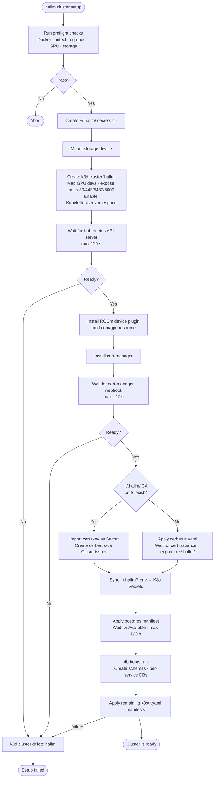

# hallm

LLM-powered assistant CLI for a local k3d cluster, backed by Postgres.

## Stack

| Layer | Tool |
| --- | --- |
| Language | Python 3.14 |
| Package manager | [uv](https://docs.astral.sh/uv/) |
| CLI | [Typer](https://typer.tiangolo.com/) |
| Type checker | [ty](https://github.com/astral-sh/ty) |
| Linter / formatter | [Ruff](https://docs.astral.sh/ruff/) |
| Database | Postgres 17 |
| Tests | Pytest + pytest-cov (98 % floor) |
| Containers | Docker Compose |
| Local Kubernetes | k3d (managed via `hallm cluster`) |
| TLS | cert-manager + self-signed CA |

## Getting started

### Prerequisites

- [uv](https://docs.astral.sh/uv/getting-started/installation/) ≥ 0.5
- Docker + Docker Compose
- [k3d](https://k3d.io/) (for the local Kubernetes cluster)

### Local setup

```bash
# Clone and enter the repo
git clone <repo-url> && cd hallm

# Copy env vars and edit as needed
cp .env.example .env

# Create venv and install deps (including dev)
uv sync

# Install pre-commit hooks
uv run pre-commit install
```

### Commit tooling

Commits must follow [Conventional Commits](https://www.conventionalcommits.org/)
with a body of at most 5 non-empty lines. Rules are defined in
[`commitlint.config.js`](commitlint.config.js) and enforced by a `commit-msg`
pre-commit hook. [`opencommit`](https://github.com/di-sukharev/opencommit)
generates messages that comply with those rules.

```bash
# Install the CLIs (once, on your machine — not project deps)
brew install commitlint opencommit

# Install the commit-msg hook (in addition to the regular pre-commit hook)
uv run pre-commit install --hook-type commit-msg

# Wire opencommit to this repo's commitlint config (once per checkout)
oco config set OCO_PROMPT_MODULE=@commitlint
oco commitlint force

# Stage your changes, then let opencommit draft the message
git add -A && oco
```

### Testing

```bash
uv run pytest
```

`pytest-cov` is wired in via `pyproject.toml` and will fail if total branch
coverage drops below **98 %**. The XML report is written to `coverage.xml`.

### Running the full stack with Docker

```bash
docker compose up --build
```

## CLI overview

`hallm` is a Typer app. Calling any namespace without a subcommand prints help.

```bash
uv run hallm                 # root help
uv run hallm cluster         # cluster lifecycle help
uv run hallm db bootstrap    # create per-service databases
uv run hallm container publish <name>   # build + push a Docker image
```

| Namespace | Commands |
| --- | --- |
| `hallm cluster` | `preflight`, `diagnose`, `mount`, `setup`, `nuke`, `healthcheck`, `start`, `stop` |
| `hallm db` | `bootstrap` |
| `hallm secrets` | `apply`, `prepare`, `password`, `token`, `get-certificate` |
| `hallm container` | `publish`, `deploy`, `remove` |
| `hallm network` | `apply`, `health` |
| `hallm headlamp` | `sync` |

## Local Kubernetes cluster

The `hallm cluster` namespace manages a local k3d cluster that mirrors the
production environment. Manifests live in [`k8s/`](k8s/); the CLI provisions
and tears the cluster down on a dedicated rootless Docker daemon.

```bash
# create cluster, install GPU device plugin + cert-manager, bootstrap Cerberus CA
uv run hallm cluster setup
# verify cluster health and run GPU + DNS smoke tests
uv run hallm cluster healthcheck
# destroy the cluster (add --volumes to also wipe PVC data)
uv run hallm cluster nuke
```

### `setup` flow


```mermaid
flowchart TD
    START([hallm cluster setup]) --> PREFLIGHT[Run preflight checks\nDocker context · cgroups · GPU · storage]
    PREFLIGHT --> PRE_OK{Pass?}
    PRE_OK -- No --> ABORT([Abort])
    PRE_OK -- Yes --> SECRETS[Create ~/.hallm/ secrets dir]
    SECRETS --> MOUNT[Mount storage device]
    MOUNT --> K3D[Create k3d cluster 'hallm'\nMap GPU devs · expose ports 80/443/5432/5000\nEnable KubeletInUserNamespace]
    K3D --> API[Wait for Kubernetes API server\nmax 120 s]
    API --> API_OK{Ready?}
    API_OK -- No --> NUKE
    API_OK -- Yes --> ROCM[Install ROCm device plugin\namd.com/gpu resource]
    ROCM --> CM[Install cert-manager]
    CM --> WEBHOOK[Wait for cert-manager webhook\nmax 120 s]
    WEBHOOK --> WH_OK{Ready?}
    WH_OK -- No --> NUKE
    WH_OK -- Yes --> CA_EXISTS{~/.hallm/ CA\ncerts exist?}
    CA_EXISTS -- Yes --> CA_IMPORT[Import cert+key as Secret\nCreate cerberus-ca ClusterIssuer]
    CA_EXISTS -- No --> CA_NEW[Apply cerberus.yaml\nWait for cert issuance · export to ~/.hallm/]
    CA_IMPORT --> SYNC[Sync ~/.hallm/*.env → K8s Secrets]
    CA_NEW --> SYNC
    SYNC --> PG[Apply postgres manifest\nWait for Available · max 120 s]
    PG --> DBBOOT[db bootstrap\nCreate schemas · per-service DBs]
    DBBOOT --> MANIFESTS[Apply remaining k8s/*.yaml manifests]
    MANIFESTS --> DONE([Cluster is ready])
    MANIFESTS -- failure --> NUKE[k3d cluster delete hallm]
    NUKE --> FAIL([Setup failed])
```

### What gets provisioned

| Component | Detail |
| --- | --- |
| Cluster | `hallm` (k3d / k3s) |
| GPU | AMD RX 6600 via `/dev/kfd` + `/dev/dri` |
| | device plugin exposes `amd.com/gpu` |
| Ingress | Traefik on ports 80 / 443 |
| TLS | cert-manager + **Cerberus** self-signed CA |
| | `cerberus-ca` ClusterIssuer |
| DNS | `*.hallm.local` → localhost via dnsmasq |
| Namespaces | `docs` (and `signoz` when `SIGNOZ_ENABLED=true`) |

### Using TLS

Annotate any Ingress with `cert-manager.io/cluster-issuer: cerberus-ca` to get
a locally-signed certificate automatically.

### GPU workloads

Every pod that uses the GPU must include:

```yaml
env:
  - name: HSA_OVERRIDE_GFX_VERSION
    value: "10.3.0"
resources:
  limits:
    amd.com/gpu: "1"
```

`HSA_OVERRIDE_GFX_VERSION=10.3.0` is required because the RX 6600
(RDNA2 / GFX 10.3) is not in ROCm's official support matrix.

## Local dnsmasq

The `hallm network` namespace wires up local dnsmasq entries so that
`*.hallm.local` resolves to `127.0.0.1` — the k3d cluster's Traefik on
`127.0.0.1:80/443`.

Source-of-truth files live in [`network/`](network/):

| File | Installed at | Notes |
| --- | --- | --- |
| `network/dnsmasq.d` | `/etc/dnsmasq.d/hallm.conf` | maps `hallm.local` → `127.0.0.1` |

```bash
uv run hallm network apply     # install config (sudo) + reload dnsmasq
uv run hallm network health    # binaries, service, drift, DNS resolution
```

## Project structure

```text
hallm/
├── cli/        # Typer CLI entry-points
│   ├── base/   # Shared subprocess / kubectl / docker / poll / template helpers
│   └── subcommands/   # cluster, db, secrets, container, network, headlamp
├── core/       # Settings, HTTP base, storage / cache / clients
k8s/            # Kubernetes manifests (applied by `hallm cluster setup`)
network/        # dnsmasq config for *.hallm.local resolution
tests/          # Pytest test suite (mirrors hallm/ layout)
docker/         # Dockerfiles
scripts/        # One-shot installers (rootless Docker, etc.)
```

## Environment variables

See [`.env.example`](.env.example) for all supported variables. Most have
sensible defaults; only the database connection vars (`DATABASE_DRIVER`,
`POSTGRES_USER`, `POSTGRES_PASSWORD`, `POSTGRES_DB`, `DATABASE_HOST`) must be supplied.

## License

MIT
